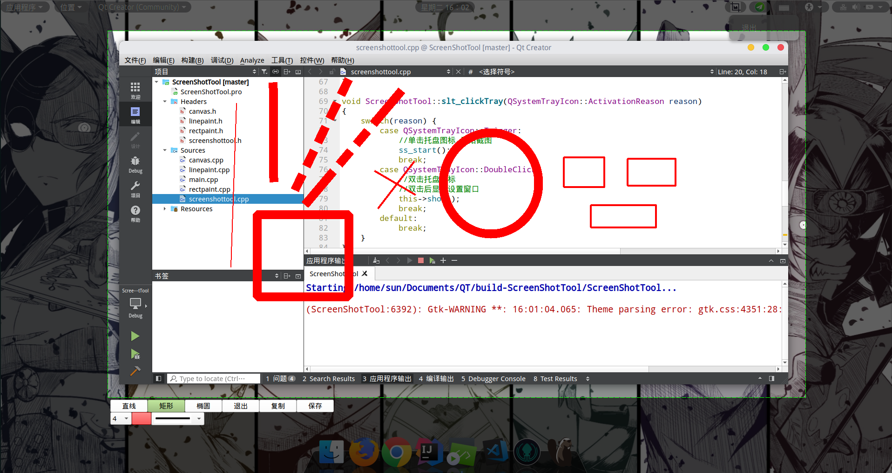

# 概述

此项目 Fork 自 [qiuzhiqian/ScreenShotTool](https://github.com/qiuzhiqian/ScreenShotTool)

主要目的是为了通过 QT 设计课的作业，所以大量的删除了原程序存在的功能。

删除了（头文件,代码，函数）：

* 设置选项（自启，多语言，快捷键）

* 设置界面所使用的 UI

* 关于我选项

现有的功能是程序启动后存在于托盘，通过单击弹出退出选项，双击触发截图功能。

---

程序启动后只存在托盘，别的界面差不多没了吧：

托盘单击后只有一个选择：退出

程序截图页面没该，只是语言改成了纯中文：

